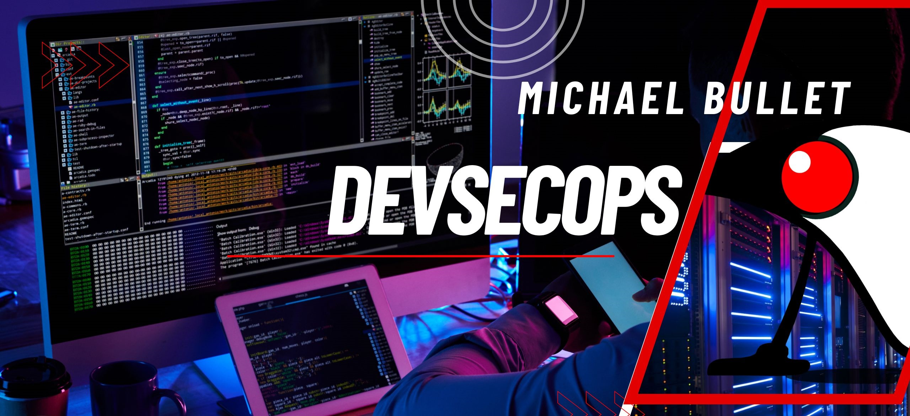

 

	 
 
 
 

  <h1>Michael Bullet</h1>
  
<strong>Fullstack Developer | Java Advocate | DevSecOps |  Cybersecurity Enthusiast</strong>

    
 
  </a>

 
---

##  Sobre mim

*  Sou apaixonado por Java, segurança ofensiva e engenharia reversa.
*  Crio ferramentas e conteúdos voltados para Devs e Pentesters.

##  Minhas Stacks

  
  
  
  

##  Ferramentas de Pentest

##  DevOps e Observabilidade

<picture>
  <source media="(prefers-color-scheme: dark)" srcset="https://raw.githubusercontent.com/Bulletdev/Bulletdev/output/pacman-contribution-graph-dark.svg">
  <source media="(prefers-color-scheme: light)" srcset="https://raw.githubusercontent.com/Bulletdev/Bulletdev/output/pacman-contribution-graph.svg">
  
</picture>

  
  
 

> “There is something in you I like more than yourself. Therefore I must destroy you.”
> — Jacques Lacan

##  Outras Plataformas

## 🎧 Spotify

  

---

## 📫 Contato

Fique à vontade para me chamar para trocar uma ideia, projetos open source, parcerias, mentorias ou só falar de xadrez:

📧 [contato@michaelbullet.com](mailto:contato@michaelbullet.com)
🔗 [michaelbullet.com](https://www.michaelbullet.com)

---

 

  
  

 

 <h1>  
 Signatures:
 </h1>
 
 

                   ⢀⣴⣿⣿⣿⣿⣿⣶⣶⣶⣿⣿⣶⣶⣶⣶⣶⣿⡿⣿⣾⣷⣶⣶⣾⣿⠀                                                                                                                          
                 ⣠⣿⣿⢿⣿⣯⠀⢹⣿⣿⣿⣿⣿⣿⣿⣿⣿⣿⣿⡇⣿⡇⣿⣿⣿⣿⣿⡇                                                                                                         
             ⠀⣰⣿⣿⣷⡟⠤⠟⠁⣼⣿⣿⣿⣿⣿⣿⣿⣿⣿⣿⣿⣿⢸⡇⣿⣿⣿⣿⣿⡇ 
             ⠀⣿⣿⣿⣿⣿⣷⣶⣿⣿⡟⠁⣮⡻⣿⣿⣿⣿⣿⣿⣿⣿⢸⡇⣿⣿⣿⣿⣿⡇ 
             ⠘⣿⣿⣿⣿⣿⣿⣿⣿⠏⠀⠀⣿⣿⣹⣿⣿⣿⣿⣿⣿⡿⢸⡇⣿⣿⣿⣿⣿⡇ 
             ⠀⠙⢿⣿⣿⣿⡿⠟⠁⣿⣿⣶⣿⠟⢻⣿⣿⣿⣿⣿⣿⡇⣼⡇⣿⣿⣿⣿⣿⠇
             ⠀⠀⠈⠋⠉⠁⣶⣶⣶⣿⣿⣿⣿⢀⣿⣿⣿⣿⣿⣿⣿⣇⣿⢰⣿⣿⣿⣿⣿⠀ 
             ⠀⠀⠀⠀⠀⠙⠿⣿⣿⣿⡄⢀⣠⣾⣿⣿⣿⣿⣿⣿⣿⣽⣿⣼⣿⣿⣿⣿⠇⠀ 
             ⠀⠀⠀⠀⠀⠀⠀⠈⠉⠒⠚⠿⠿⠿⠿⠿⠿⠿⠿⠿⠿⠛⠿⠿⠿⠿⠿⠋⠀⠀ 
             ⠀⠀⠀⠀⠀⠀⠀⠀⠀⠀⠀⠀⠀⠀⠀⠀⠀⠀⠀⠀⠀⠀⠀⠀⠀⠀⠀⠀⠀⠀ 
             ⠀⠀⠀⣿⣙⡆⠀⠀⡇⠀⢸⠀⠀⢸⠀⠀ ⢸⡇⠀⠀⢸⣏⡉  ⠙⡏⠁⠀ 
             ⠀⠀⠀⣿⣉⡷⠀⠀⢧⣀⣼ ⠀⢸⣀  ⢸⣇⡀ ⢸⣏⣁⠀ ⠀⡇⠀ 

             
  

  
  

<pre>
         ____          _  _        _     _____   ______ __      __
         |  _ \        | || |      | |   |  __ \ |  ____|\ \    / /
         | |_) | _   _ | || |  ___ | |_  | |  | || |__    \ \  / /
         |  _ < | | | || || | / _ \| __| | |  | ||  __|    \ \/ /
         | |_) || |_| || || ||  __/| |_  | |__| || |____    \  /
         |____/  \__,_||_||_| \___| \__| |_____/ |______|    \/

 </pre>

